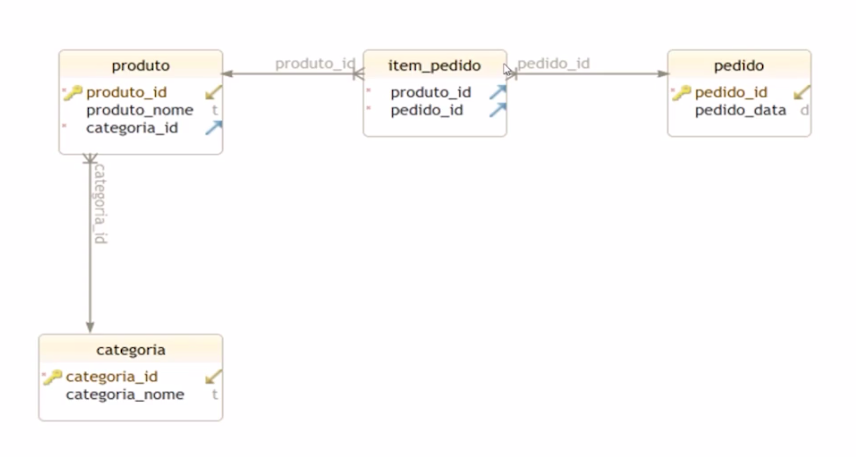

# Order Management API
This is a simple Order Management API that allows you to create, read, update and delete orders.

## How To Run

Required: Java 17

```bash
# clone repository
git clone git@github.com:DanielGMesquita/order-management-api.git

# run the project
./mvnw spring-boot:run
```

## Endpoints

### Orders

#### Create Order
```bash
POST /orders/create
```

#### Get All Orders
```bash
GET /orders/
```

#### Get Order By id
```bash
GET /orders/{id}
```
| Parameter | Type      | Description             |
|:----------|:----------|:----------------------|
| `id`      | `Integer` | **Required**. Item ID |

#### Edit Order By id
```bash
PUT /orders/update/{id}
```
| Parameter | Type      | Description             |
|:----------|:----------|:----------------------|
| `id`      | `Integer` | **Required**. Item ID |

#### Delete Order By id
```bash
DELETE /orders/delete/{id}
```
| Parameter | Type      | Description             |
|:----------|:----------|:----------------------|
| `id`      | `Integer` | **Required**. Item ID |

### Products

#### Create Product
```bash
POST /products/create
```

#### Get All Products
```bash
GET /products/
```

#### Get Order By id
```bash
GET /products/{id}
```
| Parameter | Type      | Description             |
|:----------|:----------|:----------------------|
| `id`      | `Integer` | **Required**. Item ID |

#### Edit Order By id
```bash
PUT /products/update/{id}
```
| Parameter | Type      | Description             |
|:----------|:----------|:----------------------|
| `id`      | `Integer` | **Required**. Item ID |

#### Delete Order By id
```bash
DELETE /products/delete/{id}
```
| Parameter | Type      | Description             |
|:----------|:----------|:----------------------|
| `id`      | `Integer` | **Required**. Item ID |

### Categories

#### Create Category
```bash
POST /categories/create
```

#### Get All Categories
```bash
GET /categories/
```

#### Get Category By id
```bash
GET /categories/{id}
```
| Parameter | Type      | Description             |
|:----------|:----------|:----------------------|
| `id`      | `Integer` | **Required**. Item ID |

#### Edit Cateogry By id
```bash
PUT /categories/update/{id}
```
| Parameter | Type      | Description             |
|:----------|:----------|:----------------------|
| `id`      | `Integer` | **Required**. Item ID |

#### Delete Category By id
```bash
DELETE /categories/delete/{id}
```
| Parameter | Type      | Description             |
|:----------|:----------|:----------------------|
| `id`      | `Integer` | **Required**. Item ID |

## UML Diagram


## Stack
- Java
- Spring Boot
- JPA / Hibernate
- Maven